# BIG-IP Upgrade Workflow — Decision Flow

```mermaid
flowchart LR
    START([Start: make upgrade-node]) --> ENV[Load and validate environment]
    ENV --> ROLE{Is target device standby?}
    ROLE -- No --> STOP_ACTIVE([STOP: active device is protected])
    ROLE -- Yes --> PRE[Stage 1: collect pre-upgrade state]

    PRE --> LTM_PRE[Display pre-upgrade LTM health]
    LTM_PRE --> STATE_PRE[Collect REST state]
    STATE_PRE --> EVIDENCE_PRE[Collect crypto, BGP, ASM, and ARP evidence]
    EVIDENCE_PRE --> SNAP_PRE[Save pre snapshot and CRQ evidence]

    SNAP_PRE --> SYNC[Find hostname-matching auto-sync group]
    SYNC --> SYNC_FOUND{Was a matching group found?}
    SYNC_FOUND -- No --> SAVE[Save all partition configuration]
    SYNC_FOUND -- Yes --> SYNC_PROMPT{Disable auto-sync for this group?}
    SYNC_PROMPT -- No --> SAVE
    SYNC_PROMPT -- Yes --> DISABLE[Disable only the matching group]
    DISABLE --> SAVE

    SAVE --> SAVE_OK{Did configuration save succeed?}
    SAVE_OK -- No --> STOP_SAVE([STOP: do not create backups])
    SAVE_OK -- Yes --> BACKUP[Create and download UCS, SCF, QKView, ASMQKView]
    BACKUP --> BACKUP_OK{Did every backup download successfully?}
    BACKUP_OK -- No --> STOP_BACKUP([STOP: backup evidence incomplete])
    BACKUP_OK -- Yes --> FLOW[Stage 2: upgrade flow and prechecks]

    FLOW --> LTM_FLOW[Display pre-install LTM health]
    LTM_FLOW --> CHECKS[Run readiness and configuration checks]
    CHECKS --> CHECKS_OK{Pass, or were warnings accepted?}
    CHECKS_OK -- No --> STOP_CHECKS([STOP: installation not authorized])
    CHECKS_OK -- Yes --> STORAGE[Inspect storage, images, and software volumes]

    STORAGE --> SPACE{Is free space at least 8 GiB?}
    SPACE -- No --> STOP_SPACE([STOP: insufficient image storage])
    SPACE -- Yes --> IMAGES[List /shared/images and optionally remove ISO files]
    IMAGES --> VOLUME[Display active and inactive software volumes]
    VOLUME --> ACTIVE_VOL{Is target volume active?}
    ACTIVE_VOL -- Yes --> STOP_VOLUME([STOP: active volume cannot be changed])
    ACTIVE_VOL -- No --> OLD_VOL{Does target volume already exist?}
    OLD_VOL -- Yes --> DELETE_PROMPT{Confirm delete and recreate?}
    DELETE_PROMPT -- No --> STOP_DELETE([STOP: target volume unchanged])
    DELETE_PROMPT -- Yes --> DELETE[Delete inactive target volume]
    OLD_VOL -- No --> MODE
    DELETE --> MODE{Which image mode was selected?}

    MODE -- Base ISO --> BASE_UPLOAD[Upload and verify base ISO]
    MODE -- EHF only --> EHF_BASE[Verify matching base ISO is present]
    MODE -- Base ISO plus EHF --> BOTH_UPLOAD[Upload base ISO and EHF sequentially]
    EHF_BASE --> EHF_BASE_OK{Is matching base image available?}
    EHF_BASE_OK -- No --> STOP_BASE([STOP: required base image missing])
    EHF_BASE_OK -- Yes --> EHF_INSTALL[Install EHF]
    BOTH_UPLOAD --> BOTH_VERIFY{Are both files present and compatible?}
    BOTH_VERIFY -- No --> STOP_UPLOAD([STOP: image verification failed])
    BOTH_VERIFY -- Yes --> EHF_INSTALL
    BASE_UPLOAD --> BASE_INSTALL[Install base image]

    BASE_INSTALL --> CREATE{Is target volume new?}
    EHF_INSTALL --> CREATE
    CREATE -- Yes --> CREATE_CMD[Use install command with create-volume]
    CREATE -- No --> EXISTING_CMD[Use install command without create-volume]
    CREATE_CMD --> POLL[Poll software installation status]
    EXISTING_CMD --> POLL

    POLL --> COMPLETE{Complete and expected version installed?}
    COMPLETE -- No --> STOP_INSTALL([STOP: installation failed or timed out])
    COMPLETE -- Yes --> REBOOT[Reboot standby into target volume]
    REBOOT --> BOOT_OK{Is device reachable and standby after reboot?}
    BOOT_OK -- No --> STOP_BOOT([STOP: post-boot validation failed])
    BOOT_OK -- Yes --> SUCCESS([SOFTWARE UPGRADE COMPLETED SUCCESSFULLY])

    SUCCESS --> WAIT[Stage 3: wait 1 to 180 seconds for services to recover]
    WAIT --> LTM_POST[Display post-stabilization LTM health]
    LTM_POST --> RESTORE_NEEDED{Did workflow disable auto-sync?}
    RESTORE_NEEDED -- Yes --> RESTORE[Restore only the changed auto-sync group]
    RESTORE_NEEDED -- No --> STATE_POST
    RESTORE --> STATE_POST[Collect post-upgrade state]
    STATE_POST --> EVIDENCE_POST[Collect crypto, BGP, ASM, and ARP evidence]
    EVIDENCE_POST --> SNAP_POST[Save post snapshot and CRQ evidence]

    SNAP_POST --> DIFF[Stage 4: compare pre and post snapshots]
    DIFF --> REPORT[Write JSON and Markdown reports]
    REPORT --> RESULT{Are critical regressions present?}
    RESULT -- No --> PASS([VALIDATION PASSED])
    RESULT -- Yes --> REVIEW([UPGRADE SUCCEEDED; REVIEW REQUIRED])

    classDef stage fill:#dbeafe,stroke:#2563eb,color:#111827
    classDef gate fill:#fef3c7,stroke:#d97706,color:#111827
    classDef stop fill:#fee2e2,stroke:#dc2626,color:#111827
    classDef success fill:#dcfce7,stroke:#16a34a,color:#111827

    class PRE,FLOW,WAIT,DIFF stage
    class ROLE,SYNC_FOUND,SYNC_PROMPT,SAVE_OK,BACKUP_OK,CHECKS_OK,SPACE,ACTIVE_VOL,OLD_VOL,DELETE_PROMPT,MODE,EHF_BASE_OK,BOTH_VERIFY,CREATE,COMPLETE,BOOT_OK,RESTORE_NEEDED,RESULT gate
    class STOP_ACTIVE,STOP_SAVE,STOP_BACKUP,STOP_CHECKS,STOP_SPACE,STOP_VOLUME,STOP_DELETE,STOP_BASE,STOP_UPLOAD,STOP_INSTALL,STOP_BOOT stop
    class SUCCESS,PASS,REVIEW success
```



## CRQ output layout

```text
outputs/<CRQ_NUMBER>/
├── snapshots/
│   ├── pre_state_<host>.json
│   └── post_state_<host>.json
├── evidence/
│   ├── <CRQ>_pre_asm_assoc.txt
│   ├── <CRQ>_pre_arp.txt
│   ├── <CRQ>_post_asm_assoc.txt
│   └── <CRQ>_post_arp.txt
├── backups/
├── diff_report_<host>.json
└── diff_report_<host>.md
```
